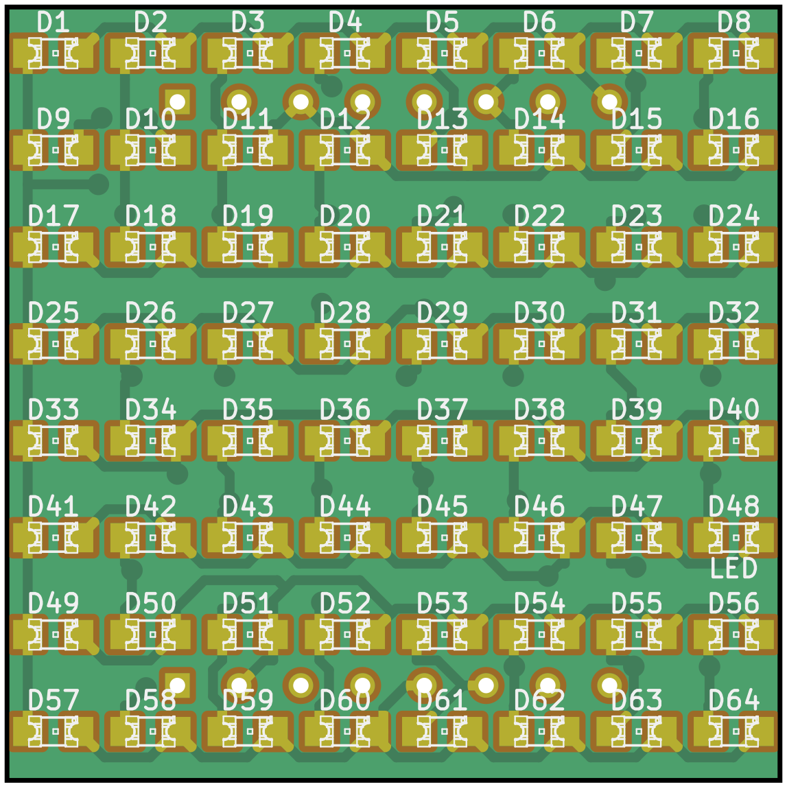
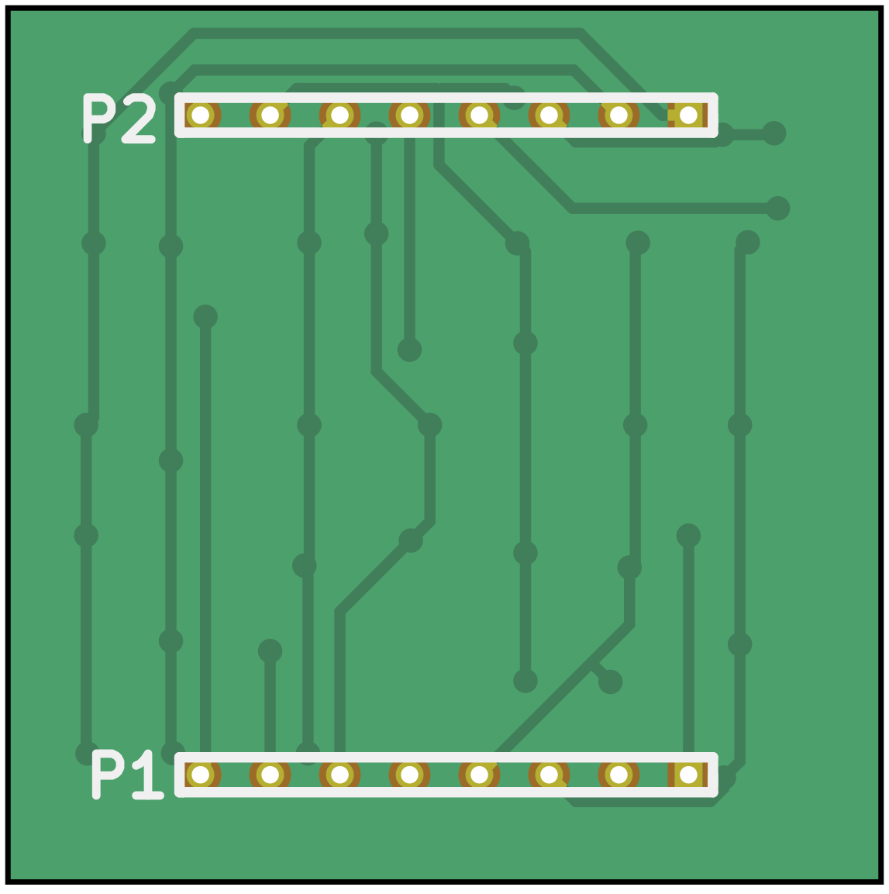
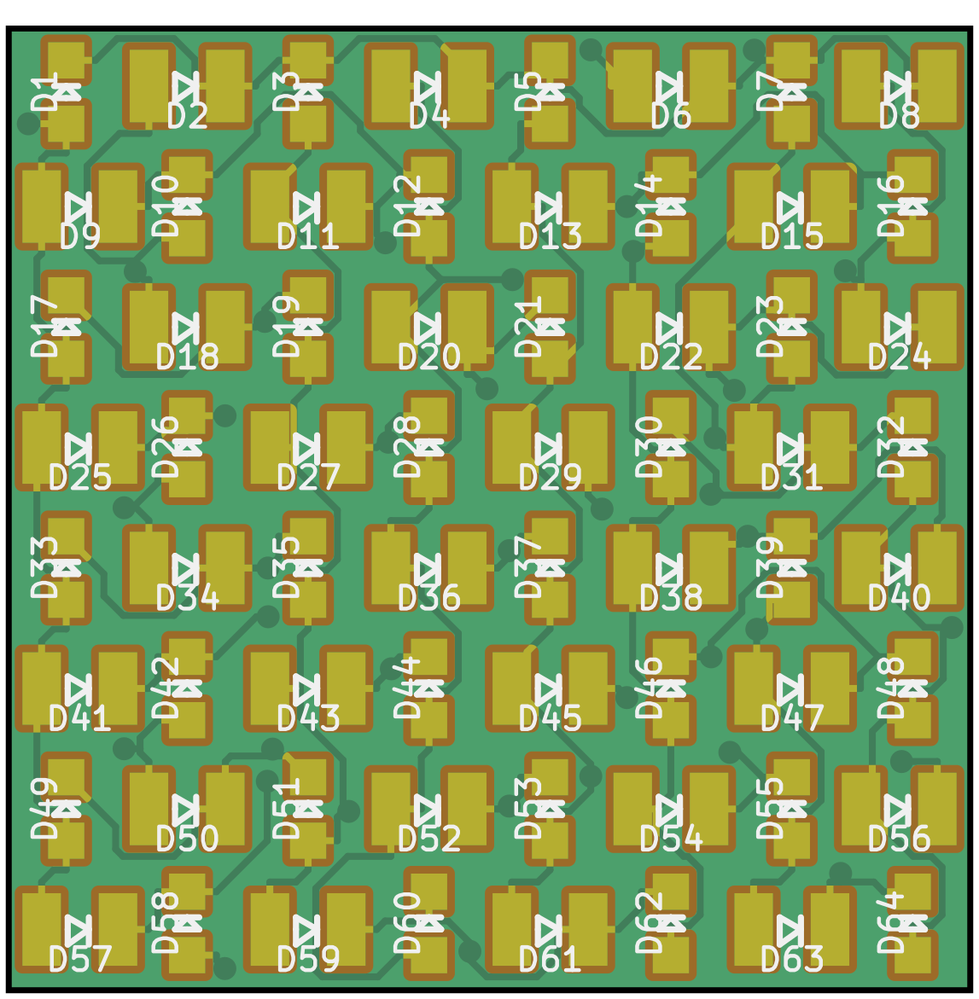
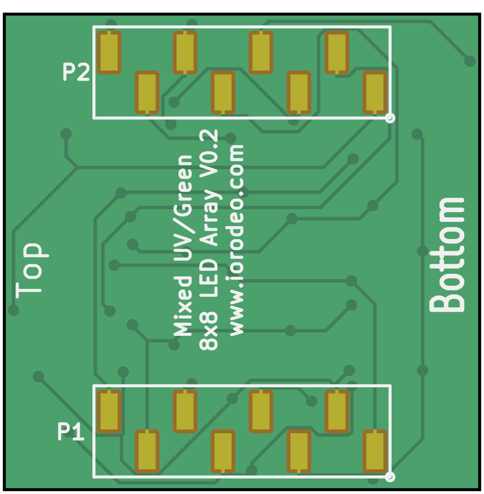

# Custom LED matrix boards

Different pre-fabricated LED matrices are available, but their emitted light spectrum is not always well specified, might differ between production batches, and don't always align well with the sensitivity of a drosophila visual system. Around 2013 there was an effort to produce custom LED matrices for [Generation 2]({{site.baseurl}}/Generation%202/Arenas/docs/g2_system.html) and [Generation 3]({{site.baseurl}}/Generation%203/) display systems. The different versions listed below are plug-in replacements for pre-fabricated LED matrices and designed to be used with the [panel boards]({{site.baseurl}}/Generation%202/Panels/docs/).

## LED array SMD 0805
{:.clear}

{:.ifr .pop}
{:.ifr .pop .clear}

The LED array SMD 0805 is a LED matrix for surface mount devices with a package size of 0805 (have a [look at the schematics](assets/led_array_smd0805_schematic.pdf)). LEDs from many different manufacturers are available in this packages size.

Historic production ready files are archived at `led_array_smd0805/production_v1/`, yet it is unclear if there was ever a PCB produced.

## LED array SMD 1411-0805
{:.clear}

{:.ifr .pop}
{:.ifr .pop .clear}

The LED array SMD 1411-0805 is a LED matrix for surface mount devices with alternating between packages size of 1411 and 0805 (have a [look at the schematics](assets/led_array_smd1411-0805_schematic.pdf)). This LED matrix was designer to use UV and green LEDs in the same matrix. The chosen UV LED by Yuli Tech with a spectrum peak at 365nm and product number __YLUV-365SMD__ has a SMD 1411 package size. There is a wide range of green LEDs in an 0805 package available, such as the Rohm __SML-210MTT86__ with a spectrum peak at 570nm.

Historic production ready files are archived at `led_array_smd0805/production_v0`. The most recently produced version was `led_array_smd1411-0805_v0p2.zip`.

## Project content
{:.clear}

```sh
├── led_array_3mm
│   └── gerber_v0p1
├── led_array_3mm_spacer
├── led_array_5mm
│   └── gerber_v0p1
├── led_array_5mm_adaptor
│   └── gerber_v0p1
├── led_array_5mm_mask
│   ├── arrayed
│   └── single
├── led_array_8x8_template
├── led_array_mixed
│   ├── gerber_v0p1
│   └── gerber_v0p2
├── led_array_sm0805
│   └── gerber_v0p1
└── pass_thru_panel
    └── gerber_v1p0
```
